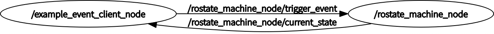

# rostate_machine
state machine library for ROS


| *master* | *develop* |
|----------|-----------|
|[](https://travis-ci.org/OUXT-Polaris/rostate_machine)|[](https://travis-ci.org/OUXT-Polaris/rostate_machine)|

# How to use

## Example  

launch example state machine  
```
roslaunch rostate_machine example.launch  
```
if you succeed to launch, the message was appeared in the terminal  
```
[ INFO] [1556286488.574721992]: from : /example_event_client_node, succeed to transition, current state : emergency, event_name : motor_disconnected
[ INFO] [1556286488.674441095]: from : /example_event_client_node, failed to transition, current state : emergency, event_name : stop_motor
```
If you want to check whole state machine, you shold execute commands below
```
roscd rostate_machine/data
dot -T pdf example_state_machine.dot -o example_state_machine.pdf
evince example_state_machine.pdf
```
You can see pdf like below.  


rostate_machine node and event_client communticate with state and event topic


State Topic (rostate_machine/State)
```
Header header
string current_state
string[] possible_transitions
string[] possible_transition_states
```

Event Topic (rostate_machine/Event)
```
Header header
string trigger_event_name
```

## Tutorial
### Make XML file in order to define state machine  

```
<state_machine>
    <init_state name="remote_operated"/>

    <callback tag="become_autonomos" when="on_entry" states="autonomous"/>
    <callback tag="stop_motor" when="on_exit" states="autonomous,remote_operated"/>
    <callback tag="check_motor" when="always" states="autonomous,remote_operated"/>

    <transition from = "remote_operated" to="autonomous" name="system_bringup"/>
    <transition from = "remote_operated" to="emergency" name="motor_disconnected"/>
    <transition from = "autonomous" to="remote_operated" name="manual_override"/>
    <transition from = "autonomous" to="emergency" name="motor_disconnected"/>
</state_machine>
```

transition element defines how to change states in the state machine.
rostate_machine node subscribe event topic and chenge state when the event name was matched with name attribute in the transition element in the XML.

callback element defines which callback function was called.
callback functions are managed with tag by using event_client.
states attribute in callback element defines the states in which calls callback.
states was defined by "," splited string.

when attribute defines when the callback function was called.
now, rostate_machine supports "always","on_exit","on_entry" values.
if you set when="always", callback function was called when the current_state topic was recieved and the current_state was matched with states value.
if you set when="on_exit" or when="on_entry", callback function was called when the current_state topic was recieved and the state was changed.
when="on_exit", the tagged callback functions was called when the state was changed from the setted states.
when="on_entry", the tagged callback functions was called when the state was changed to the setted states.

### Register Callback function to the EventClient class

add EventClient class to your ROS node and register callback by using EventClient::registerCallback function.

```
void EventClient::registerCallback(std::function<boost::optional<rostate_machine::Event>(void)> func,std::string tag)
```